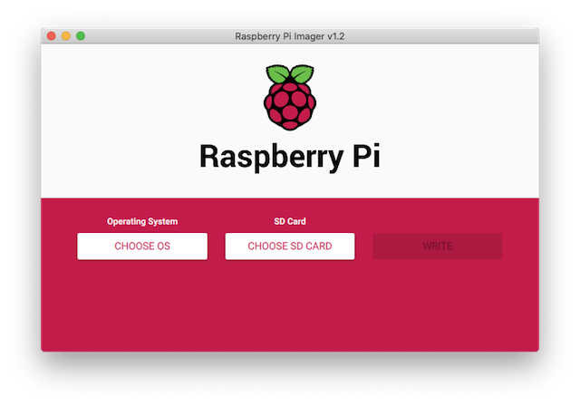
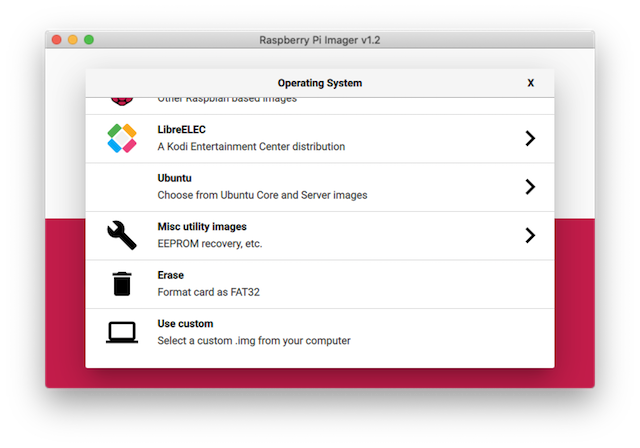
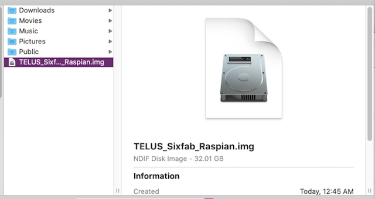
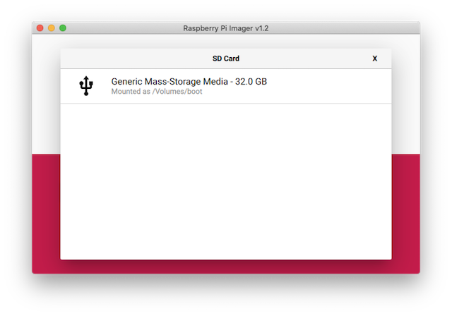
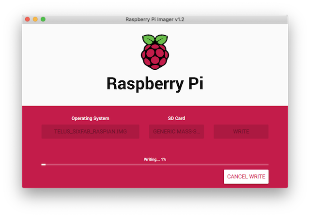
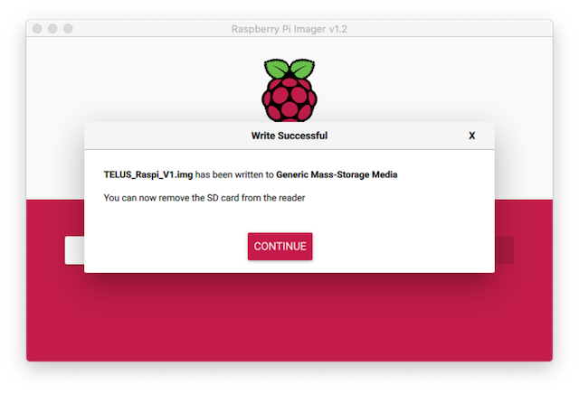

# TELUS_Sixfab_Raspi_Image
Pre-configured Raspiberry Pi image for TELUS devit comes with the following pre-installed:

1. **`PPP dialer`**, tutorial can be found here: https://github.com/TELUS-Emerging-IoT/TELUS-Devkit-Hardware-Tutorial/tree/Updated-TELUS-Cat-M1-Shield

2. **`Sixfab RPi Library and demo applications`**, can be found here: https://github.com/TELUS-Emerging-IoT/TELUS_Sixfab_RPi_CellularIoT_App_Shield 

# Download the image

1. Download the pre-configured TELUS Raspberry Pi image here: https://iotdevkit.s3.ca-central-1.amazonaws.com/TELUS_Sixfab_Raspian.img.zip

2. Unzip the file.

# Write image to SD card

`You need 32GB size SD card.`

3. Download and install Raspberry Pi imager software for your OS here: https://www.raspberrypi.org/downloads/

4. Launch the app after download.

5. Select "Use custom" option and choose the downloaded image.

6. Select SD card

7. Write and Verify

8. Done

9. Unmount (eject) SD card and insert to Raspberry Pi and power up.
